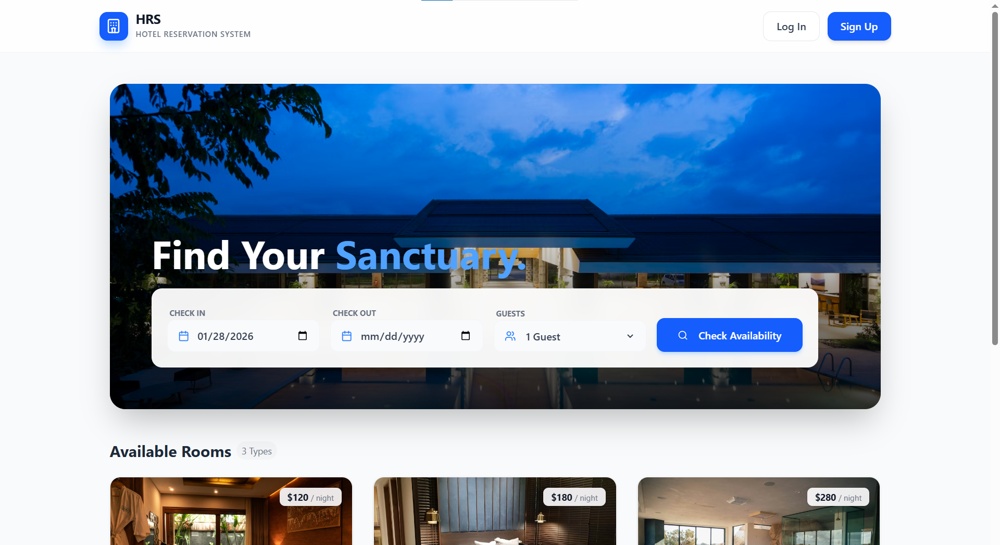
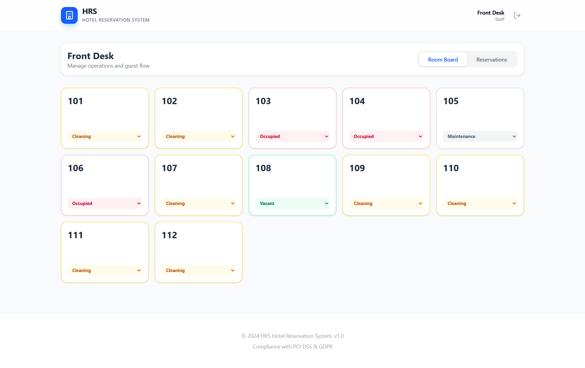
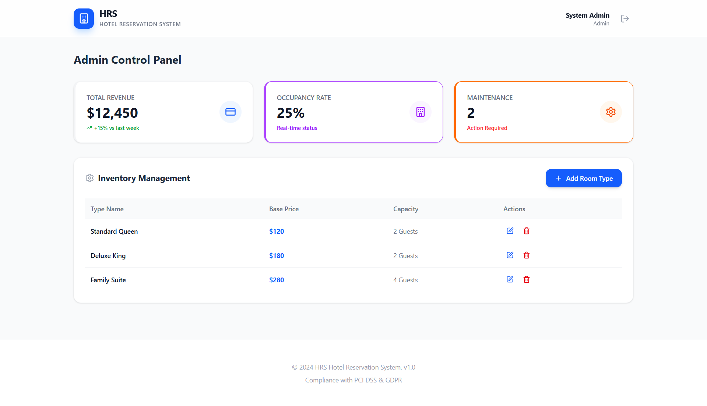

# Hotel Reservation System (HRS)

A modern, web-based platform for managing hotel reservations, designed to streamline operations for guests, staff, and administrators. This system features a responsive frontend built with React and supports flexible backend integrations (simulated Local Storage or Headless CMS).

## Demo

🔗 **Live Demo:** [HRS-gerges.vercel.app](https://hrs-gerges.vercel.app/)

📁 **GitHub Repo:** [Hotel Reservation System](https://github.com/Gerges-GN/Hotel-Reservation-System)

## Screenshots

<table>
<tr>
<td>Guest page</td>
<td>Staff page</td>
<td>Admin page</td>
</tr>
</table>

## Features

**For Guests**
- Seamless Booking Flow: Search for rooms by date and capacity, view detailed amenities, and complete reservations in just a few clicks.
- Real-time Availability: Smart filtering shows only available rooms, preventing double bookings.
- User Accounts: Register and log in to fast-track bookings with pre-filled contact information.

**For Hotel Staff**
- Front Desk Dashboard: Monitor room status (Vacant, Occupied, Cleaning, Maintenance) in real-time.
- Check-in/Check-out: Efficiently manage guest arrivals and departures with a single click.
- Live Reservations List: View all active and upcoming bookings at a glance.

**For Administrators**
- Inventory Management: Add, update, or remove room categories (Standard, Deluxe, Suite) dynamically.
- Performance Insights: View key metrics like occupancy rates and total revenue.

## Tech Stack

**Frontend:** React.js (Vite)
**Styling:** Tailwind CSS & Lucide Icons
**State Management:** React Hooks (useState, useEffect)
**Data Persistence:** Browser localStorage (No backend required for demo).

## Testing Scenarios

_The system includes built-in logic to handle specific test cases:_

**Auth (TS-01):** Guest registration and login validation.
**Search (TS-02):** Date logic validation (e.g., check-out must be after check-in).
**Reliability (TS-06):** Double-booking prevention logic.

### _Demo Credentials:_
**Admin:** admin@hrs.com / admin123
**Staff:** staff@hrs.com / staff123

## Installation & Setup

**Prerequisites**

- Node.js (v16 or higher)
- npm or yarn

1. Clone the Repository

    git clone [`https://github.com/yourusername/hrs-frontend.git`](https://github.com/yourusername/hrs-frontend.git)

    `cd hrs-frontend`

2. Install Dependencies

    `npm install`

3. Run the Application

    `npm run dev`

Open `http://localhost:5173` to view it in your browser.
